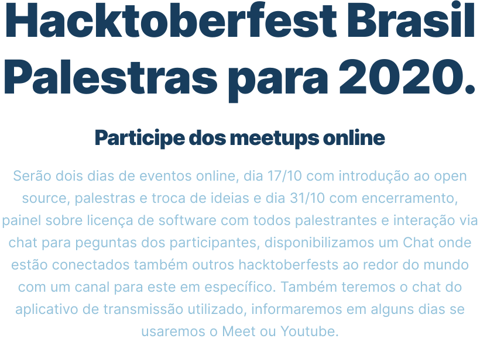

### Olá Brasil! 👋

---

Assista o evento no Youtube:

### Live do dia 17/10
https://youtu.be/B1cc706vhHs?t=256

### Palestras do dia 31/10
- Alvaro Neto: Po-Ui https://youtu.be/dEENiQ3y1A4
    A jornada da criação de um Design System Open Source
- William Grasel https://youtu.be/i1syrPOr-Ak
    Publicando projetos open source com JavaScript
- Américo Neto https://youtu.be/NNDx5ncUES4
    Automatizando a publicação de pacotes com Semantic release
- Eduardo Villas Boas https://youtu.be/DppTBLKHs50
    Design e arquitetura voltada para testes
- Flavio Correa https://youtu.be/86AhqDu1kJg
    NVDA, um leitor de tela gratuito, de código aberto e acessível globalmente para cegos e deficientes visuais.
- Sebastian Ferrari https://youtu.be/Vo0UT8SysVs
    Como o Open Source pode contribuir para a cultura das empresas
- Elton Minetto https://youtu.be/pUl1eTTCcc4
    Arquitetura de software e a Clean Architecture
- Edson Yanaga https://youtu.be/uBPJup0zF-8
    Grandes empresas no mercado Open Source (Painel)
