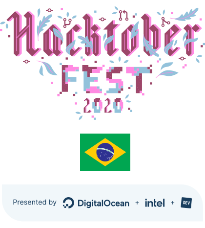

### Olá Brasil! 👋

<button
  href="https://github.com/hacktoberfestbrasil/2020/issues/new/choose"
  style="width: 300px; height: 120px;border: none;background: #072540;color: #93c2db;cursor: pointer;padding: 0;position: relative;line-height: 120px;font-size: 32px;font-weight: bold;transition: background 200ms ease-in-out, color 200ms ease-in-out;font-family: 'Proxima Nova', sans-serif;">Quero contribuir
<svg width="320px" height="140px" viewBox="0 0 320 140">

  <path d="M10,10 l300,0 0,120 -300,0 0, -120"></path>
  
</svg>
</button>

<!--
**hacktoberfestbrasil/hacktoberfestbrasil** is a ✨ _special_ ✨ repository because its `README.md` (this file) appears on your GitHub profile.

Here are some ideas to get you started: 

- 🔭 I’m currently working on ...
- 🌱 I’m currently learning ...
- 👯 I’m looking to collaborate on ...
- 🤔 I’m looking for help with ...
- 💬 Ask me about ...
- 📫 How to reach me:...
- 😄 Pronouns: ...
- ⚡ Fun fact: ...
-->
